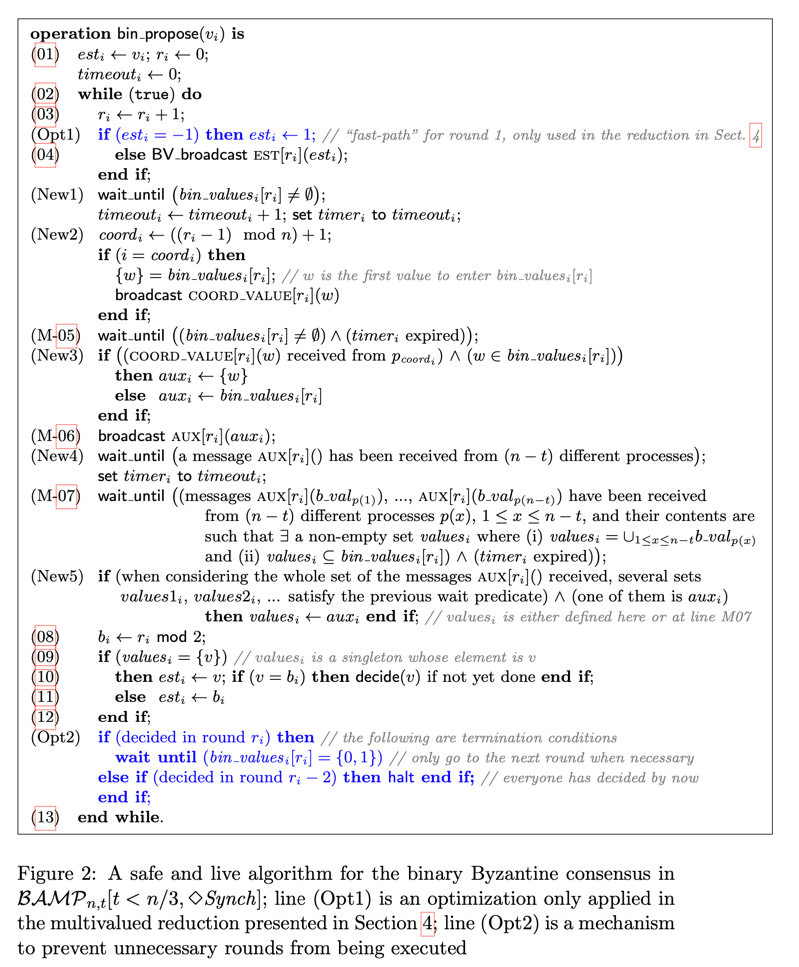

# Consensus

- [Project Actors](#project-actors)
- [Consensus Algorithm](#consensus-algorithm)
- [Business Goals](#business-goals)
- [Technical choices](#technical-choices)
  - [Core Software Engineering Techniques (Distributed Domain Driven Design)](#core-software-engineering-techniques-distributed-domain-driven-design)
  - [High Level Technological Stack](#high-level-technological-stack)
  - [Relevant Literature backing our engineering choices](#relevant-literature-backing-our-engineering-choices)
- [Architecture and Patterns](#architecture-and-patterns)
  - [Data Transformation Flow](#data-transformation-flow)
  - [Data Flow](#data-flow)
- [Dolla Consensus (Implementation)](#dolla-consensus-implementation)
  - [Overview](#overview)
  - [Inputs/Outputs and Flow](#inputsoutputs-and-flow)
  - [Sections](#sections)
    - [Proposing](#proposing)
    - [Consenting](#consenting)
    - [Broadcasting](#broadcasting)
    - [Voting](#voting)
    - [Transacting Consensus Requests](#transacting-consensus-requests)

# Project Actors

This project is
- Owned by [Dolla](http://dolla.org)
- Under the technical responsibility of [Nicolas Henin](https://www.linkedin.com/in/nhenin/) ([Eventuria](https://github.com/eventuria))

A special note for [ComposeWell](https://github.com/composewell) (Founder Harendra Kumar) and our heavy use of their [Streamly](https://github.com/composewell/streamly) Library.

Thanks for their support,collaboration and professionalism !

# Consensus Algorithm

The Dolla consensus is an implementation of the ***Democratic Byzantine Fault Tolerant*** (**DBFT**) algorithm.

It has been described by *Tyler Crain, Vincent Gramoli, Mikel Larrea and Michel Raynal* in the following [academic paper](/dbft/DBFT.pdf)

Algorithm essential characteristics and claims from this paper
- Applicable in semi-open blockchain (consortium blockchain)
- **Transaction finality**, Once the consortium reaches a consensus, the decision is not reversible.
- **Energy efficiency**, DBFT can achieve a distributed consensus without carrying out complex mathematical computations (like in PoW)
- **Low reward variance**, Every node in the network takes part in responding to the request by the client and hence every node can be incentivized leading to low variance in rewarding the nodes that help in decision making. The fee distribution model can be completely decided at the consortium governance level.
- No need for signatures
- Weak coordinator
- Partial synchrony in the voting phase
- Time and resilient optimal
- Claims < 1s latency in their experiments (even under byzantine attacks...)
- **High Transactional Volume**
  - `n` nodes is `n` potential proposals of x requests each.
  - The `Accepted Proposal` set is merged deterministically.

Following academic paper recommendations, we have also implemented
- the "[Reliable Broadcast Primitive](/dbft/proposalBroadcast.pdf)" from  *Gabriel Bracha* (Used for Proposal Broadcasting)
- the "[Binary-Value Broadcast Primitive](/dbft/binaryBroadcast.pdf)" from  *Achour Mostéfaouil, Hamouma Moumen and Michel Raynal* (Used in the Voting phase)

# Business Goals

The primary consensus objective is to support high transactional volumes and latencies competing the financial market leaders (Mastercard,Visa ...)
- 10k transactions /s
- Transactions < 5 s
- Security
- Low transaction fees
- Optimal Maintenance

Seeking Simplicity and High Performance, We are translating these business goals into the following system properties
- Modularity
- Reactivity
- Predictability
- Traceability

# Technical choices
## Core Software Engineering Techniques (Distributed Domain Driven Design)
- [Domain Driven Design](https://en.wikipedia.org/wiki/Domain-driven_design)
- SEDA Architecture ( [CQRS](https://docs.microsoft.com/en-us/azure/architecture/patterns/cqrs)/ [Event Sourcing](https://martinfowler.com/eaaDev/EventSourcing.html)/ [Microservices](https://en.wikipedia.org/wiki/Microservices))
- Functional Reactive Programming Paradigm : Streams and Logs (FIFO) are natural DDDD Architecture Building Blocks.

All these concepts are building blocks for implementing the [Kahn process networks (KPNs, or process networks)](https://en.wikipedia.org/wiki/Kahn_process_networks), A concurrent [model of computation](https://en.wikipedia.org/wiki/Model_of_computation) used as a Pattern / Architecture for distributed systems.

## High Level Technological Stack
- FP : Haskell ecosystem
- FRP
  - Multi/Mono threading Streaming : [Streamly](https://github.com/composewell/streamly) Haskell Library by [ComposeWell](https://github.com/composewell) - (CEO - [Harandra Kumar](https://confengine.com/user/harendra-kumar))
  - Persistent Streaming Data Management
    - Proof of concept/design : [EventStore](https://eventstore.com/) (Event Sourcing Database) for Proof of concept
    - Production : [Apache Cassandra](https://en.wikipedia.org/wiki/Apache_Cassandra) and [Apache Kafka](https://kafka.apache.org/) for Better Scaling when necessary

## Relevant Literature backing our engineering choices
- [Domain-Driven Design: Tackling Complexity in the Heart of Software](https://www.oreilly.com/library/view/domain-driven-design-tackling/0321125215/)
- [Making Sense Of Stream Processing : The Philosophy behind Apache Kafka and Scalable Stream Data Platform](https://www.confluent.io/wp-content/uploads/2016/08/Making_Sense_of_Stream_Processing_Confluent_1.pdf)
- [Designing Data-Intensive Applications](https://www.oreilly.com/library/view/designing-data-intensive-applications/9781491903063/)

# Architecture and Patterns

This architecture is
- a [Biomimicry](https://en.wikipedia.org/wiki/Biomimetics) (emulation of the models, systems, and elements of nature for the purpose of solving complex human problems), it reuses fundamental concepts around [Fluids](https://en.wikipedia.org/wiki/Fluid) over information
  - Flows
  - Transformation
  - Storage
- [Fractal](https://en.wikipedia.org/wiki/Fractal) - Application of FRP paradigm at an architectural level.
  - Immutability Over States with Event Sourcing/CQRS
  - Maximizing Determinism Over Non Determinism (see Pipeline vs Junctions)
  - Declarative Design
  - Composability/Modularity
  - Transformation over Data (FP) **vs** Data over Transformation (OOP)
  - ...

The system can be seen and understood through 2 dimensions
- **Data Flow** : How Data is moving ?
- **Data Transformation Flow** : How Data is transformed ?

## Data Flow
Data flows through
- Rapid-access memory
  - Mono-threading
  - Multi-threading
- Network (via sockets)

Data is Staged ( [SEDA - Staged event-driven architecture](https://en.wikipedia.org/wiki/Staged_event-driven_architecture) )
- Accumulated in Storage Memory
    - Guaranteed writes : No lost events
    - Idempotency : replaying a deterministic pipeline has no effect on the persisted output stream (no duplicated events)

Data is Pulled over Pushed (see [here](https://blog.call-cc.be/post/streamcompare/) for definitions)

## Data Transformation Flow
Processing is a composition of
- **Pipelines** (function composition)
  - a persisted input stream
  - a line of pipes welded together
    - sourcing inputs
    - a composition of **deterministic** *Pipes*
    - sinking outputs
  - a persisted output stream


- **Junctions** (Merger)
  - a set of persisted input streams
  - a **nondeterministic** logic for merging these input streams
  - a persisted output stream (input of a pipeline)


We are calling **Section** (Modularisation), a meaningful set of Pipelines and Junctions put together.

# Dolla Consensus (Implementation)

## Overview


## Inputs/Outputs And Flow

A consensus node receives requests and produces transactions in a ledger.

Using CQRS Terminology
- requests = [commands](https://docs.microsoft.com/en-us/azure/architecture/patterns/cqrs).
- transactions = [events](https://docs.microsoft.com/en-us/azure/architecture/patterns/cqrs).
- Morphisms between commands and events are defined by a [Fold](https://composewell.github.io/streamly/master/Streamly-Data-Fold.html) holding the State Machine.

```haskell
Fold m command [event] 
```
- We are Recording the meaningful facts happening in the system.
- We store the transitions (events) of the `Fold` state-machine instead the final state.
- We are recreating a state-machine from an event subset previously stored (Projection).

Data Flow
- Stage requests collected into files called Local Proposals
- Broadcast proposals to other nodes
- Vote each proposal will be transacted or not
- Transact proposal requests accepted : ``` request/command -> [event]```
- Append events into consortium ledgers

Requests Types

- **Customer Request**
  - Can be any request from the business layer using the consensus platform.
  - The Consensus is agnostic of these requests. The behavior is polymorphic.
  - The Fold logic is not part of the consensus, it's external.

- **Consensus Request**
  - Sent from the consortium members themselves.
  - These requests modify the consensus logic
    - Add/Remove/Grant/Revoke a Member in the Consortium
    - Update the version of the consensus running
    - etc...
  - Each Consensus Sections folds/projects a specific logic over the consensus events appended into the **Consensus Ledger** (Ledger = persisted stream).

## Sections

## Proposing

As first part of the consensus flow, "proposing" means :
- **Receptioning** requests from customers and consortium members
- **Detecting** if the local proposal flow is tensed, meaning if the consensus has consumed more local proposals than being staged.
- **Staging** these requests into local proposals respecting the following properties
  - `0 < Proposal File Size < Proposal File Size Limit`
  - if the downstream flow is starving with local proposal, the current requests accumulated are staged into a new Local Proposal.

   [Proposing section](https://github.com/dolla-consortium/consensus-proposing) is ***open source*** 

In this github repository, you will
- See concrete implementations and details of A Section
- Be able to :
  - Set Up your environment
  - Build & Run Tests
  - Build & Run A Simulated Consensus Proposing (only Mac Osx)

N.B : This section is not described in the [DFBT Academic Paper](/dbft/DBFT.pdf). It's a Dolla creation.

> See our specific open source [github repository](https://github.com/dolla-consortium/consensus-proposing) for more information.

## Consenting

For the current block in progress
- Coordinates **Broadcasting** and **Voting** Flows
- Provides the list of Accepted and Rejected proposals for a block
- Claims that a Consensus is reached for a block

From the [academic paper](/dbft/DBFT.pdf) cited above, our implementation is based on the following pseudo-imperative-code


Here are some translations into our own vocabulary
- **RB_broadcast** (RB Means Reliable Broadcast) is the algorithm used to broadcast Proposals between nodes
- **bin_propose** is the algorithm used to vote within the consortium

> See our specific [github repository](https://github.com/dolla-consortium/consensus-other-sections) for more information (Access Rights Required).

## Broadcasting

For the current block in progress
- Submit the next not-already-consumed Local Proposal for being Synced
- Sync proposals (pull information) from Active Nodes
- Sync proposals sync status (pull information) from Active Nodes based on "[Reliable Broadcast Primitive](/dbft/proposalBroadcast.pdf)" from  *Gabriel Bracha* (Used for Proposal Broadcasting)
- Notify When A Proposal is Delivered
- Use [zero-copy](https://en.wikipedia.org/wiki/Zero-copy) mechanism

> See our specific [github repository](https://github.com/dolla-consortium/consensus-other-sections) for more information (Access Rights Required).

## Voting

For the current block in progress
- Handle rounds of voting
- Sync voting round status from Active Nodes
- Notify When A Proposal Decision is Delivered

From the [academic paper](/dbft/DBFT.pdf) cited above, our implementation is based on the following pseudo-imperative-code


- **BV_broadcast** is the following [Binary-Value Broadcast Primitive](/dbft/binaryBroadcast.pdf)" from  *Achour Mostéfaouil, Hamouma Moumen and Michel Raynal*

> See our specific [github repository](https://github.com/dolla-consortium/consensus-other-sections) for more information (Access Rights Required).

## Transacting Consensus Requests

- **Consensus Requests** are sent from the consortium members themselves. These requests modify the consensus logic :
  - Add/Remove/Grant/Revoke a Member in the Consortium
  - Update the version of the consensus running
  - etc...

- Using the CQRS terminology, `Transacting` is the moment where the Fold is executed

```haskell
Fold m command [event] 
```

- The Events produced are appended into the **Consensus Ledger** (Ledger = persisted stream).
- Each Consensus Sections folds (projects) a specific State Model over these persisted events.

> See our specific [github repository](https://github.com/dolla-consortium/consensus-other-sections) for more information (Access Rights Required).